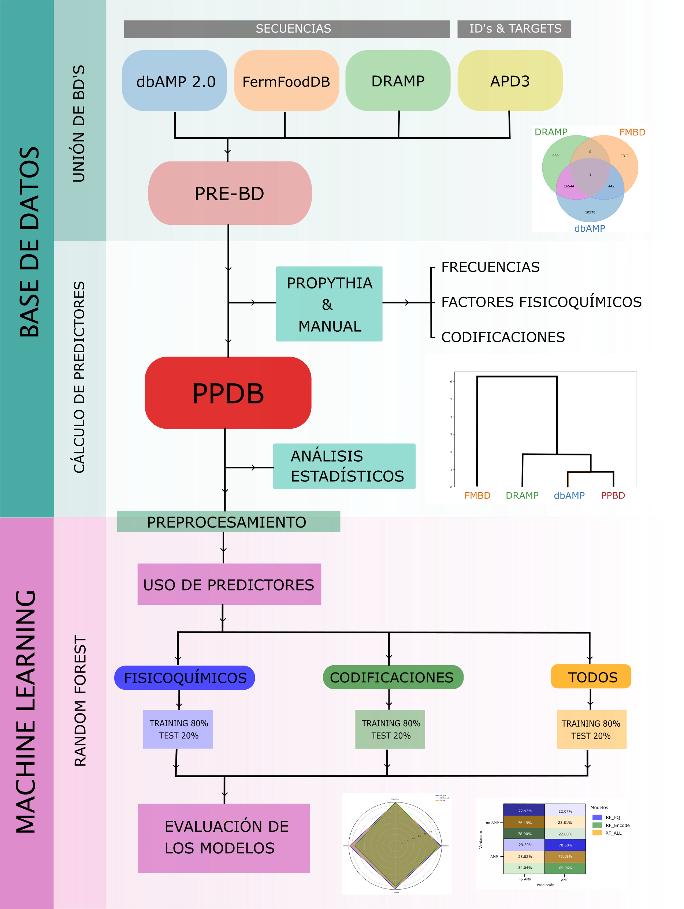

# Peptide Profiler Data Base (PPBD)

Este proyecto presenta la creación y validación de la Peptide Profiler Data Base (PPDB), una nueva base de datos de secuencias peptídicas antimicrobianas, integrada a partir de dbAMP 2.0, FermFooDb (FMDB) y el Data Repository of Antimicrobial Peptides (DRAMP).

## Introducción

La creciente resistencia a los antibióticos convencionales ha impulsado la búsqueda de nuevas alternativas terapéuticas. Entre estas, los péptidos antimicrobianos (AMPs) destacan debido a su eficacia en inhibir o eliminar microorganismos patógenos como bacterias, hongos y virus. Los AMPs ejercen su actividad antimicrobiana a través de mecanismos como la perturbación de la membrana celular, la interferencia con la síntesis de la pared celular, proteínas o ácidos nucleicos, y la activación de respuestas inmunológicas. Su capacidad para actuar en múltiples frentes reduce la posibilidad de que los patógenos desarrollen resistencia, convirtiéndolos en candidatos ideales para desarrollar nuevos medicamentos. Por otro lado, es importante considerar los péptidos sin actividad antimicrobiana (noAMP), aunque en la literatura no están definidos como un grupo. Estos péptidos pueden desempeñar otras funciones biológicas, como roles estructurales, de señalización o en la regulación de procesos celulares, pero no contribuyen directamente a la defensa contra infecciones.

El objetivo global de este trabajo es elaborar una base de datos o catálogo que recoja péptidos con actividad antimicrobiana y sin actividad antimicrobiana. Esta base de datos servirá como recurso fundamental para trabajar en problemas de clasificación mediante técnicas de machine learning. Al proporcionar un conjunto de datos amplio y bien caracterizado de péptidos, se facilitará el desarrollo y la evaluación de modelos de aprendizaje automático que puedan predecir la actividad antimicrobiana de nuevos péptidos. Esta aproximación tiene el potencial de acelerar el descubrimiento de nuevos AMPs y optimizar su diseño, contribuyendo así a la lucha contra la resistencia a los antibióticos.

## Descripción de los archivos y directorios:

- **db**: Directorio que contiene los scripts para la creación de PPBD, archivos necesarios, y resultados.
  - **creacion_db.ipynb**: Este archivo contiene el código y las instrucciones necesarias para crear la base de datos PPDB a partir de los datos en bruto.
  - **db_stat_FQ.ipynb**: Jupyter Notebook con estadísticas y análisis de las bases de datos. Este archivo proporciona un análisis detallado de la calidad y características de los datos contenidos en la PPDB.
  - **files_results**: Directorio que contiene los resultados de los análisis.
    - **db_all_stat.csv**: Archivo CSV para el análisis estadístico de las bases de datos. Contiene diversas estadísticas descriptivas sobre la PPDB.
    - **db_AMP_ML.csv**: Archivo CSV curado para aprendizaje automático. Este archivo está preparado específicamente para ser utilizado en modelos de machine learning.
  - **graph_plots**: Directorio con gráficos generados durante los análisis. Contiene diversas visualizaciones que ilustran los resultados de los análisis y las características de los datos.
  - **sub_files_bds**: Directorio con archivos necesarios para la creación de las bases de datos. Incluye datos adicionales y scripts auxiliares que fueron utilizados en el proceso de construcción de la PPDB.

- **Model**: Directorio que contiene los modelos de aprendizaje automático.
  - **archivos**: Directorio con archivos de datos utilizados en los modelos.
    - **db_all.csv**: Archivo CSV con todos los datos.
    - **db_encode.csv**: Archivo CSV con los datos codificados.
    - **db_encode_aplanado.csv**: Archivo CSV con los datos codificados y aplanados.
    - **db_FQ.csv**: Archivo CSV con datos específicos de calidad.
  - **best_models**: Directorio con los mejores modelos entrenados. Aquí se encuentran los modelos de machine learning que han mostrado mejor rendimiento durante la fase de entrenamiento y validación.
  - **encoding_eddf75.xlsx**: Archivo Excel con las codificaciones utilizadas en los modelos. Este archivo es esencial para entender las transformaciones aplicadas a los datos antes del entrenamiento de los modelos.
  - **figuras**: Directorio que contiene figuras generadas durante el proceso de modelado y análisis.
  - **Validacion_db_ML.ipynb**: Jupyter Notebook con los análisis y modelos de aprendizaje automático. Este archivo documenta el proceso de validación de los modelos, incluyendo métricas de rendimiento y visualizaciones.

- **README.md**: Archivo con la descripción general del proyecto. Proporciona una visión general del propósito y uso del proyecto, incluyendo instrucciones de instalación y uso.
- **graphical_abstract.png**: Imagen del resumen gráfico del proyecto. Una visualización concisa que resume los principales hallazgos y metodologías del proyecto.
- **LICENSE**: Archivo de licencia del proyecto. Contiene los términos y condiciones bajo los cuales se puede utilizar y distribuir el proyecto.

